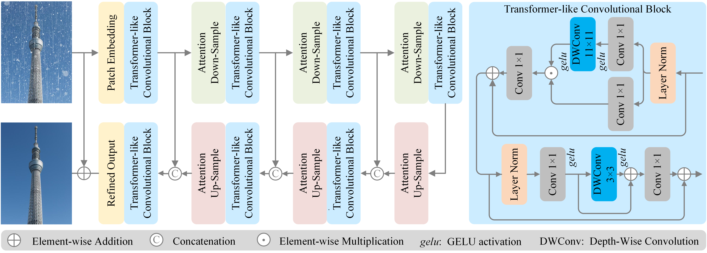

### Towards an Effective and Efficient Transformer for Rain-by-Snow Weather Removal

**Abstract**: The rain-by-snow weather removal process is one of the specialized weather-degraded image restoration tasks. This paper proposes RSFormer, an effective and efficient Transformer to eliminate coexisting rain streaks and snow particles. Initially, we explore the proximity of ConvNets and ViTs in hierarchical architecture and experimentally find that they perform approximately at intra-stage feature learning. On this basis, we utilize a Transformer-like convolution block (TCB) to extract intra-stage features instead of calculation-heavy self-attention backbones. Meanwhile, we preserve attention characteristics for adapting to input content. Furthermore, we indicate that cross-stage progression plays another critical role in performance improvement. Therefore, a global-local self-attention sampling mechanism (GLASM) is developed to down-/up-sample features while capturing both global and local dependencies other than commonly used (transposed) convolution or pixel-(un)shuffle. Finally, we synthesize two novel rain-by-snow datasets, RSCityScape and RS100K, to evaluate the performance of our proposed RSFormer. Extensive experiments verify that RSFormer achieves the best trade-off between performance and time-consumption compared to state-of-the-art restoration methods. For example, RSFormer outperforms Restormer with a 1.53% reduction in the number of parameters and a 15.6% reduction in inference time.

github: https://github.com/chdwyb/RSFormer




**Dataset**

| Dataset     | Download Link                                                |
| ----------- | ------------------------------------------------------------ |
| RSCityScape | [[Google Drive](https://drive.google.com/file/d/1OnpsBl7-6hH6AjZPcKvuBj4qC7KvgkIy/view?usp=sharing)]     [[Baidu Cloud](https://pan.baidu.com/s/1Vh3PRk7igaWsJjEg1ZamaQ) code: olu5] |
| RS100K      | [[Baidu Cloud](https://pan.baidu.com/s/1h74tJy5VBZaAN6whGVQIhA?) code: ixul] |
| RS300       | [[Google Drive](https://drive.google.com/file/d/12hMgdTLPRCc6X_GETtTQP0rnqM5Y9Tn8/view?usp=sharing)]     [[Baidu Cloud](https://pan.baidu.com/s/11Q8iAg2yQ32PEJX-u3iphw?pwd=ozyw) code: ozyw] |


**Quick Test**

We provide a `demo.py` for you to have a quick test. If you want to test rain-by-snow weather removal, you may download the pre-trained model of RSCityScape dataset here, link: [[Google Drive](https://drive.google.com/file/d/1TQ0axqqWvCjKHDIRXu6LAiz55ZDxB7Wa/view?usp=sharing)]     [[Baidu Cloud](https://pan.baidu.com/s/1TkK0IWdUAPuB1HZ802BxWw?pwd=0blh) code: 0blh]. If you want to test image desnowing, you may download the pre-trained model of Snow100K dataset here, link: [[Google Drive](https://drive.google.com/file/d/17fG4-P09ltIYroxKz6-Fo1wZXY5las5h/view?usp=sharing)]     [[Baidu Cloud](https://pan.baidu.com/s/1C9_mxgvcwEeR9AIIDX1iUw?pwd=5qop) code: 5qop]. Please note to change the paths in `config.py`.

```python
python demo.py
```


**Acknowledgement**

We are sincerely grateful to the work of [DesnowNet](https://github.com/linYDTHU/DesnowNet_Context-Aware_Deep_Network_for_Snow_Removal), [PReNet](https://github.com/csdwren/PReNet), [MPRNet](https://github.com/swz30/MPRNet), [Uformer](https://github.com/ZhendongWang6/Uformer), [TransWeather](https://github.com/jeya-maria-jose/TransWeather), [SnowFormer](https://github.com/Ephemeral182/SnowFormer), [Restormer](https://github.com/swz30/Restormer).


**Contact us**

Currently the repository is ***still*** being prepared, further details to be included soon. Wherever you have any questions about our work, you may contact us by : [wyb@chd.edu.cn; wenyuanbo0@gmail.com]

